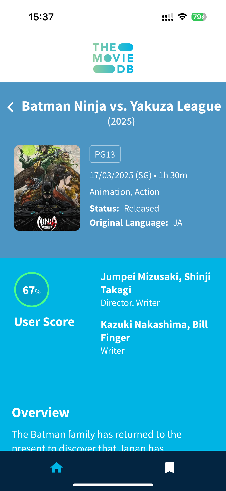

# Movie Database App (Technical Test - Mien PV)

A React Native mobile application for browsing movies using The Movie Database (TMDB) API.

## Screenshots (iPhone 15 real device)

  
  
  
  
  

## App Demo

  

## Features

- Browse popular, top rated, upcoming and now playing movies
- Search for movies by title
- View detailed movie information including:
  - Overview
  - Release date
  - Rating
  - Cast
  - Similar movies
- Sort movies by popularity, rating or release date
- Infinite scroll loading
- Responsive grid layout
- Clean and modern UI

## Technical Details

- Built with React Native and TypeScript
- Uses TMDB API for movie data
- State management with MobX
- Custom reusable UI components
- Optimized performance with:
  - Efficient list rendering
  - Image caching
  - Debounced search
  - Pagination

## Getting Started

1. Clone the repository
2. Install dependencies with `yarn install`
3. Add your TMDB API key to `.env` file
4. Run on iOS: `yarn ios`
5. Run on Android: `yarn android`

Note: You'll need to add your screenshots to a `/screenshots` directory in the project root for the images to display properly.
